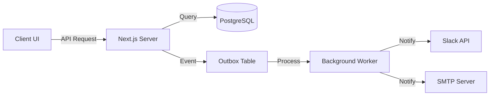

# System Architecture

## 🏗️ The Big Picture (Logical View)

This view explains how the system functions from a user and process perspective.

### 1. The User Flow
1. **Student** logs in (via Clerk) and submits a **Ticket**.
2. System analyzes the **Category** and **Location** to find the correct **Admin**.
3. **Admin** receives a notification (Slack/Email) and views the ticket on the **Dashboard**.
4. Admin interacts (Comments, Status Updates) -> Student is notified.
5. If unresolved, ticket **Escalates** to senior staff.
6. Upon resolution, Student provides **Feedback**.

### 2. Data Flow

---

## ⚙️ Under the Hood (Technical View)

This view explains the technology stack and implementation details.

### 1. Core Stack
- **Framework**: Next.js 14 (App Router)
  - Server Components for data fetching.
  - Client Components for interactivity.
  - Server Actions for mutations.
- **Language**: TypeScript (Strict mode).
- **Styling**: Tailwind CSS + shadcn/ui.

### 2. Database Layer
- **PostgreSQL**: Primary data store.
- **Drizzle ORM**: Type-safe database access.
- **Schema**: Normalized relational data (Users, Tickets, Categories).
- **Migrations**: Managed via Drizzle Kit.

### 3. Authentication & Authorization
- **Auth**: Clerk (External Provider) handles identity.
- **Sync**: Webhooks sync Clerk users to our `users` table.
- **RBAC**: Custom Role-Based Access Control.
  - Roles: `student`, `admin`, `super_admin`.
  - Scopes: `domain` (Hostel/College), `scope` (Block/Dept).
  - Middleware protects routes based on roles.

### 4. Asynchronous Processing
We use a **Worker Pattern** for reliability:
- **Outbox Pattern**: Atomic writes to DB + Outbox ensure data consistency.
- **Cron Jobs**: Vercel Cron triggers scheduled tasks (TAT reminders).
- **Separation of Concerns**: UI is fast; heavy lifting (emails, API calls) happens in background.

### 5. Deployment
- **Platform**: Vercel (Serverless).
- **Edge**: Middleware runs on Edge runtime for low latency.
- **Database**: Hosted PostgreSQL (e.g., Neon/Supabase).

## 📂 Directory Structure

- `src/app`: Next.js App Router pages and API routes.
- `src/components`: Reusable UI components.
- `src/db`: Database schema and connection logic.
- `src/lib`: Utility functions (Slack, Email, Auth).
- `src/workers`: Background job handlers.
- `docs`: Project documentation.
